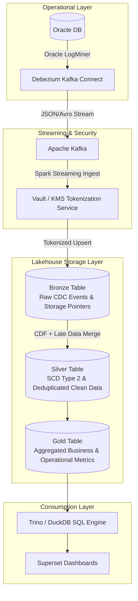

# Architecture Brief: CDC Ride-hailing Lakehouse & Privacy Compliance

## 1. Problem Statement
Hệ thống vận tải và gọi xe quy mô lớn sinh ra **100 triệu chuyến/năm, với đỉnh điểm đạt 30,000 writes/sec** tại thời điểm cao điểm. Toàn bộ dữ liệu giao dịch thay đổi (Transactional Changes) trên cơ sở dữ liệu quan hệ Oracle DB được thu thập thông qua Debezium CDC và đẩy xuống hạ tầng Lakehouse để phục vụ phân tích.

**Các ràng buộc kỹ thuật & nghiệp vụ cốt lõi:**
*   **Compliance (Bảo mật pháp lý):** Phải tuân thủ nghiêm ngặt **Nghị định 13/2023/NĐ-CP** về bảo vệ dữ liệu cá nhân (PII như số điện thoại, ID, định vị GPS của tài xế và hành khách).
*   **SLA Real-time Analytics:** Các dashboard kinh doanh và giám sát vận hành phải được cập nhật $\le$ 60 giây kể từ thời điểm giao dịch được ghi nhận tại cơ sở dữ liệu nguồn.
*   **Data Quality (Xử lý dữ liệu đến muộn):** Hạ tầng bắt buộc phải xử lý mượt mà các sự kiện đến muộn (Late-arriving events) do tài xế mất kết nối mạng ở các tỉnh xa.

---

## 2. Architecture Diagram

*Sơ đồ kiến trúc Medallion kết hợp CDC Stream, mã hóa PII tự động tại Bronze và quản lý biến động dữ liệu qua Change Data Feed (CDF).*

---

## 3. Architecture Decisions

### D1: Lựa chọn Định dạng Bảng (Table Format) cho Lakehouse

* **Quyết định:** Chọn **Delta Lake** làm định dạng lưu trữ cốt lõi nhờ khả năng hỗ trợ native `MERGE` cực mạnh và tính năng **Change Data Feed (CDF)** tối ưu cho streaming.
* **Alternative 1 (Apache Parquet thuần):** Loại bỏ. Parquet không hỗ trợ cập nhật dữ liệu (Upsert) trực tiếp; việc thay đổi trạng thái chuyến đi sẽ đòi hỏi phải viết lại toàn bộ phân vùng (rewrite partitions), gây tốn kém chi phí tính toán nghiêm trọng.
* **Alternative 2 (Apache Hudi):** Loại bỏ. Mặc dù Hudi mạnh về Upsert, hệ sinh thái tích hợp với các công cụ truy vấn nhanh và định dạng native Python (`deltalake` bindings) không đồng bộ và tối ưu bằng Delta Lake trong bối cảnh lab này.

### D2: Chiến lược Bảo mật Dữ liệu Cá nhân (Compliance NĐ-13)

* **Quyết định:** Thực hiện **Tokenization (Mã hóa thay thế)** ngay lập tức tại cổng nạp dữ liệu trước khi ghi xuống bảng Bronze. Chuyển đổi số điện thoại thực `0901234567` thành một chuỗi token định danh `TKN_A8F9`, trong đó bảng ánh xạ gốc được quản lý biệt lập trong hệ thống HashiCorp Vault.
* **Alternative 1 (Chỉ mã hóa/mặt nạ hóa dữ liệu tại tầng Silver):** Loại bỏ. Việc để dữ liệu PII dạng thô (raw data) tràn xuống tầng Bronze tạo ra rủi ro vi phạm nguyên tắc "Security by Design". Khi có yêu cầu thực thi "Right to Erasure" (Quyền được quên), việc rà soát và xóa sạch dữ liệu thô ở tầng lưu trữ gốc vô cùng phức tạp.
* **Alternative 2 (Dùng Dynamic Data Masking của Query Engine):** Loại bỏ. Dữ liệu vật lý nằm trên object storage vẫn chứa PII nguyên bản, tiềm ẩn rủi ro lộ lọt nếu người dùng có quyền truy cập trực tiếp vào file Parquet.

### D3: Xử lý Sự kiện Đến muộn (Late-Arriving Events)

* **Quyết định:** Áp dụng mô hình **SCD Type 2 (Slowly Changing Dimension)** tại lớp Silver thông qua câu lệnh `MERGE WHEN MATCHED AND src.updated_at > tgt.updated_at`.
* **Alternative 1 (Ghi đè trực tiếp - Overwrite):** Loại bỏ. Nếu một sự kiện cũ được đẩy lên sau sự kiện mới do mạng chập chờn, hành động ghi đè vô điều kiện sẽ làm sai lệch chuỗi trạng thái thời gian thực của chuyến đi.
* **Alternative 2 (Loại bỏ sự kiện đến muộn):** Loại bỏ. Làm mất mát dữ liệu doanh thu và lịch sử hành trình quan trọng của tài xế.

### D4: Quản lý Lineage & Orchestration

* **Quyết định:** Sử dụng **Dagster tích hợp OpenLineage** để điều phối các đường ống dữ liệu, tự động sinh metadata tracking xuống cấp độ cột (column-level lineage).
* **Alternative 1 (Apache Airflow thuần túy):** Loại bỏ. Airflow quản lý dựa trên task đơn thuần, không hỗ trợ theo dõi vòng đời tài nguyên dữ liệu và dòng chảy lineage ở cấp độ chi tiết (cột dữ liệu).
* **Alternative 2 (Không dùng Lineage Tooling):** Loại bỏ. Gây khó khăn lớn trong việc kiểm toán và truy vết nguồn gốc dòng dữ liệu khi có sự cố pháp lý về rò rỉ thông tin cá nhân.

### D5: Tối ưu hóa Hiệu năng I/O & FinOps cho Storage

* **Quyết định:** Tự động hóa tác vụ **Compaction** (chạy mỗi 30 phút để gom file nhỏ từ streaming) kết hợp **Z-ORDER** theo `driver_id` và `city_code` (chạy định kỳ hàng ngày lúc 2h sáng).
* **Alternative 1 (Chỉ dựa vào Partitioning theo ngày):** Loại bỏ. Dữ liệu CDC cập nhật liên tục sinh ra hàng triệu file nhỏ (small-file problem), làm suy giảm hiệu năng đọc nghiêm trọng.
* **Alternative 2 (Chạy OPTIMIZE liên tục sau mỗi micro-batch):** Loại bỏ. Gây lãng phí tài nguyên tính toán (Spark Compute Cost) một cách vô lý.

---

## 4. Failure Modes & Rollback Mechanisms

1. **Lỗi Lệch Trạng thái Dòng Stream (State Skew / Data Loss)**
* **Nguyên nhân:** Job Spark Streaming gặp lỗi Out-Of-Memory (OOM) khiến offset Kafka bị trôi, gây ra tình trạng sót hoặc lặp dữ liệu CDC.
* **Phát hiện & Rollback:** Nhận cảnh báo OpenLineage khi sản lượng dữ liệu gãy khúc đột ngột. Tạm dừng stream, sử dụng tính năng **Time Travel của Delta Lake (`RESTORE TO VERSION`)** để đưa bảng Silver về thời điểm ổn định trước đó, sau đó khôi phục offset Kafka về mốc checkpoint tương ứng.

2. **Lộ lọt PII do Lỗi Cấu hình Tokenization**
* **Nguyên nhân:** Bug phát sinh trong đoạn code gọi Vault, khiến số điện thoại hoặc thông tin nhạy cảm lọt qua lớp Bronze dưới dạng dữ liệu thô.
* **Phát hiện & Rollback:** Phát hiện thông qua hệ thống kiểm định dữ liệu định kỳ (Data Quality Assertions). Sử dụng **Delta Deletion Vectors** để vô hiệu hóa tức thì các dòng dữ liệu vi phạm mà không cần viết lại toàn bộ file vật lý, đồng thời vá lỗi code và chạy backfill bổ sung.

3. **Bùng nổ Chi phí Metadata Bloat trên Object Storage**
* **Nguyên nhân:** Tốc độ 30K writes/sec tạo ra lượng log JSON quá lớn trong `_delta_log/`, làm chậm quá trình lập kế hoạch truy vấn (Scan Planning) của Trino.
* **Phát hiện & Rollback:** Giám sát qua chỉ số `S3 List Requests Metric` tăng cao đột biến. Giải quyết bằng cách cấu hình tạo **Log Checkpoint** tự động (`.checkpoint.parquet`) và bật chính sách **`VACUUM RETAIN 168 HOURS`** để thu hồi file rác.

---

## 5. Storage & Compute Cost Estimates (Monthly)

**Quy mô giả định tính toán:**

* 100 triệu chuyến/năm $\rightarrow$ ~273,000 chuyến/ngày. Tính kèm các trạng thái trung gian (đặt xe, hủy, hoàn thành), ước tính khoảng **2 triệu CDC events/ngày**.
* Kích thước 1 record CDC json ~ 1 KB $\rightarrow$ 2 GB Raw/ngày $\rightarrow$ **~ 60 GB/tháng** dữ liệu Bronze. Tầng Silver và Gold lưu trữ dưới dạng nén Parquet tương đương **~ 20 GB/tháng**.

**Chi phí AWS S3 (Region: us-east-1):**

* **Storage (Bronze + Silver + Gold):** Tổng dung lượng ~~80 GB S3 Standard $\times$ $0.023 = ~~$1.84 / tháng.
* **API Requests (PUT/GET):** Do micro-batch chạy liên tục mỗi phút, chi phí API PUT ước tính = **~$50 / tháng**.

**Chi phí Compute (Databricks / Cloud Spark Cluster):**

* **Streaming Pipeline (Bronze to Silver):** 1 worker node nhỏ (2 cores, 8GB RAM) chạy 24/7 = **~$150 / tháng**.
* **Batch & Maintenance Jobs (Gold aggregation, Optimize):** Chạy 4 giờ/ngày trên cluster vừa = **~$100 / tháng**.

$\rightarrow$ **Tổng chi phí vận hành ước tính:** **~ $301.84 / tháng** (Cực kỳ tối ưu về mặt FinOps cho một hệ thống quy mô doanh nghiệp lớn).

---

## 6. One-Week MVP Plan

Để kiểm chứng tính khả thi của kiến trúc trong thời gian ngắn, thay vì triển khai toàn bộ hệ thống ngay lập tức, tuần đầu tiên sẽ tập trung vào cơ chế kỹ thuật khó nhất: **Xử lý sự kiện đến muộn bằng lệnh MERGE SCD Type 2**.

* **Scope:** Xây dựng luồng xử lý từ Bronze sang Silver cho tập dữ liệu mẫu trong 1 ngày có trộn lẫn các sự kiện trễ giờ.
* **Thực thi:**
1. Khởi tạo bảng Delta Lake ở tầng Silver, định nghĩa rõ cột quản lý phiên bản thời gian `updated_at`.
2. Viết logic PySpark thực hiện câu lệnh `MERGE INTO`: Chỉ cập nhật trạng thái mới nếu `source.updated_at > target.updated_at`.

* **Acceptance Criteria (Tiêu chí nghiệm thu):** Nạp vào hệ thống bản ghi "Chuyến xe X hoàn thành lúc 10h05" nhưng lại đến trễ sau bản ghi "Chuyến xe X hủy lúc 10h10". Sau khi chạy lệnh Merge, bảng Silver phải bảo toàn trạng thái chính xác theo mốc thời gian thực tế mới nhất (10h10), không bị ghi đè ngược sai logic.
